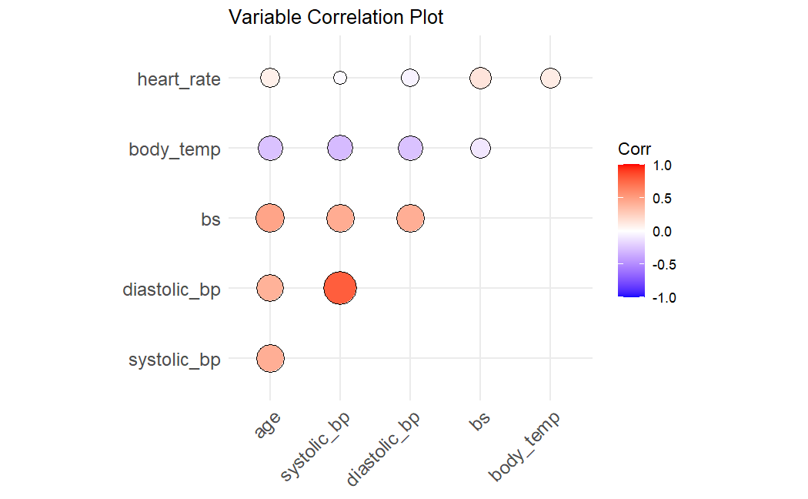
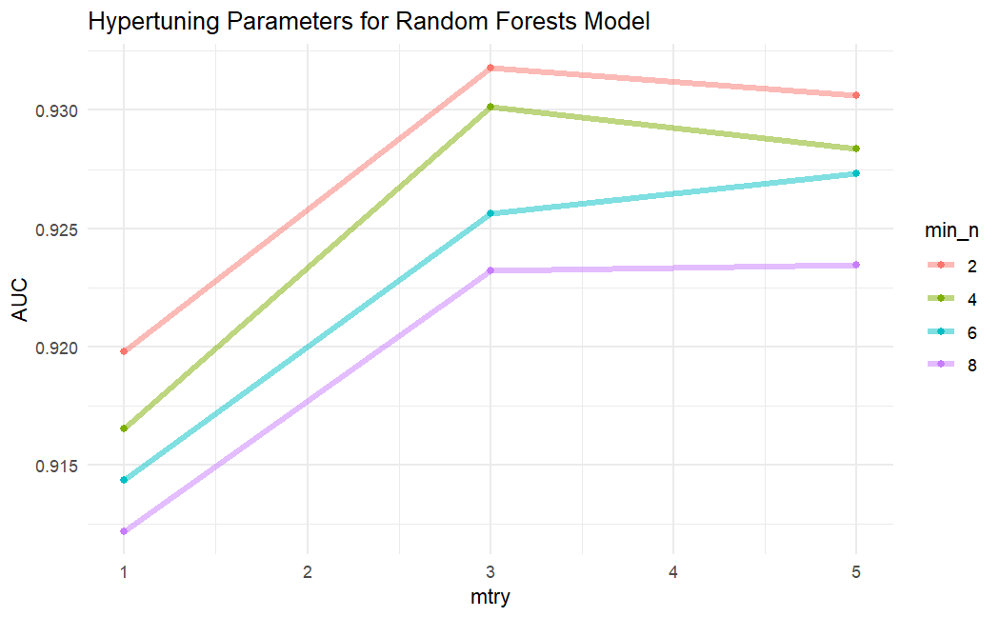

# Lab 6: Random Forests & Maternal Health

This lab was a learning module as part of the ESM 244 course in Advanced Data Analysis Methods.

**What I learned, and the type of analysis I can quickly support:**
- **Language**: R
- **Data Analysis Methods:** Random Forests & Multinomial Regression ([parsnip](https://cran.r-project.org/web/packages/parsnip/index.html)).
- **Other Activities:** Hyperparameter tuning ([tune](https://cran.r-project.org/web/packages/tune/index.html)), Correlation plots ([ggcorrplot](https://cran.r-project.org/web/packages/ggcorrplot/index.html)), Making pretty tables 🙃 ([kableExtra](https://cran.r-project.org/web/packages/kableExtra/index.html)),

